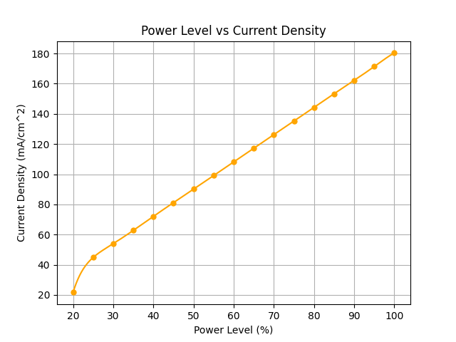

# Electrolyzer Performance Analysis Project

This repository contains **Python code and data analysis tools** for evaluating the performance of a Proton Exchange Membrane (PEM) electrolyzer. The project uses experimental data (from Excel spreadsheets) to calculate key performance metrics, generate plots, and fit electrochemical models.

---

## 📂 Repository Structure

```
ElectrolyzerAnalysis/
├── README.md                # Project overview (this file)
├── requirements.txt         # Python dependencies
├── .gitignore               # Ignore cache/temp files
├── LICENSE                  # License for usage/sharing
│
├── data/
│   └── raw/                 # Raw input data (e.g. Book1.xlsx)
│  
│
├── src/                     # Main analysis scripts
│   ├── combinedplotswithslider.py
│   ├── plot_all_metrics.py
│   └── tafelequation.py
│
├── results/
│   └── plots/               # Generated PNG graphs
│  
│
├── docs/                    # Extra documentation & references
└── plc/                     # Placeholder for Main PLC logic
```

---

## ⚡ Project Overview

The goal of this project is to analyze experimental data from an electrolyzer and calculate key performance metrics:

* **Faradaic efficiency (ηF)** – How effectively charge is used to produce hydrogen.
* **Voltage efficiency (ηV)** – Ratio of reversible voltage (≈1.23 V) to actual cell voltage.
* **Cell efficiency (ηcell)** – Product of ηF and ηV (energy conversion efficiency).
* **Overall efficiency (ηenergy)** – Ratio of hydrogen energy output to electrical energy input.
* **Tafel analysis** – Fits the Tafel equation to extract electrode kinetic parameters.

All metrics are calculated and visualized using Python scripts. Plots are automatically saved under `results/plots/`.

---

## 🛠️ Setup and Usage

### Requirements

* Python 3.8+ (tested in **Visual Studio Code**)
* Install dependencies:

  ```bash
  pip install -r requirements.txt
  ```

### Running the analysis

1. Place your raw Excel data file (`Book1.xlsx`) into `data/raw/`.
2. Run the scripts from VS Code or the command line:


**Generate plots (all metrics):**

```bash
python src/src/plot_all_metrics.py
```

**Calculate efficiencies with slider:**

```bash
python src/src/combinedplotswithslider.py
```


**Tafel analysis:**

```bash
python src/src/tafelequation.py
```

Output CSVs will be saved in `results/data_outputs/`, and PNG plots in `results/plots/`.

---

## 📊 Efficiency Calculations (Formulas)

**Faradaic Efficiency (ηF):**

$\eta_F = \frac{n_{H_2} \cdot 2F}{I t} \times 100\%$

or equivalently:

$\eta_F = \frac{V_{H2,exp}}{V_{H2,theo}}$

**Voltage Efficiency (ηV):**

$\eta_V = \frac{E_{rev}}{V_{cell}}$

**Cell Efficiency (ηcell):**

$\eta_{cell} = \eta_F \times \eta_V$

**Overall Energy Efficiency (ηenergy):**

$\eta_{energy} = \frac{H_{H_2} \cdot V_{H2,exp}}{U I t}$

**Tafel Equation:**

$\eta = A \log_{10}\left(\frac{i}{i_0}\right)$

where:

* *A* = Tafel slope
* *i₀* = exchange current density

---

## 📈 Results and Plots

### Power Level vs Current Density



### Power Level vs Voltage Cell


### Current Density vs Real Hydrogen Volume Flow


### Voltage Cell vs Real Hydrogen Volume Flow


### Voltage Cell vs Voltage Efficiency


### Current Density vs Faradaic Efficiency


### Power Level vs Faradaic Efficiency


### Power Level vs Cell Efficiency


### Power Level vs Voltage Efficiency


### Power Level vs All Efficiencies Combined


### Tafel Equation Plot


---

## 📚 References

* [Faraday efficiency – Wikipedia](https://en.wikipedia.org/wiki/Faraday_efficiency)
* [Tafel Equation – Wikipedia](https://en.wikipedia.org/wiki/Tafel_equation)
* [NREL Electrolysis Efficiency Report](https://docs.nrel.gov/docs/fy10osti/47302.pdf)
* [Introduction to Electrolyzers – Fuel Cell Store](https://www.fuelcellstore.com/blog-section/introduction-to-electrolyzers)

---
